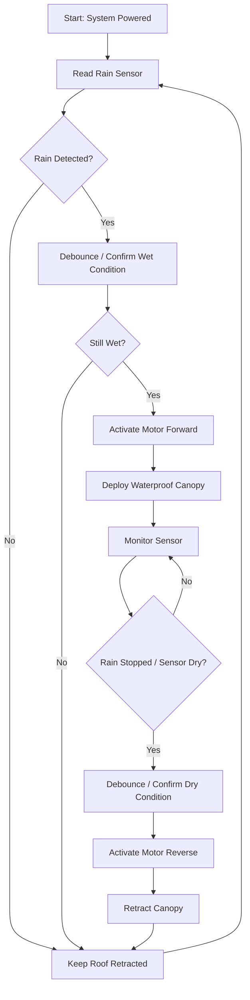
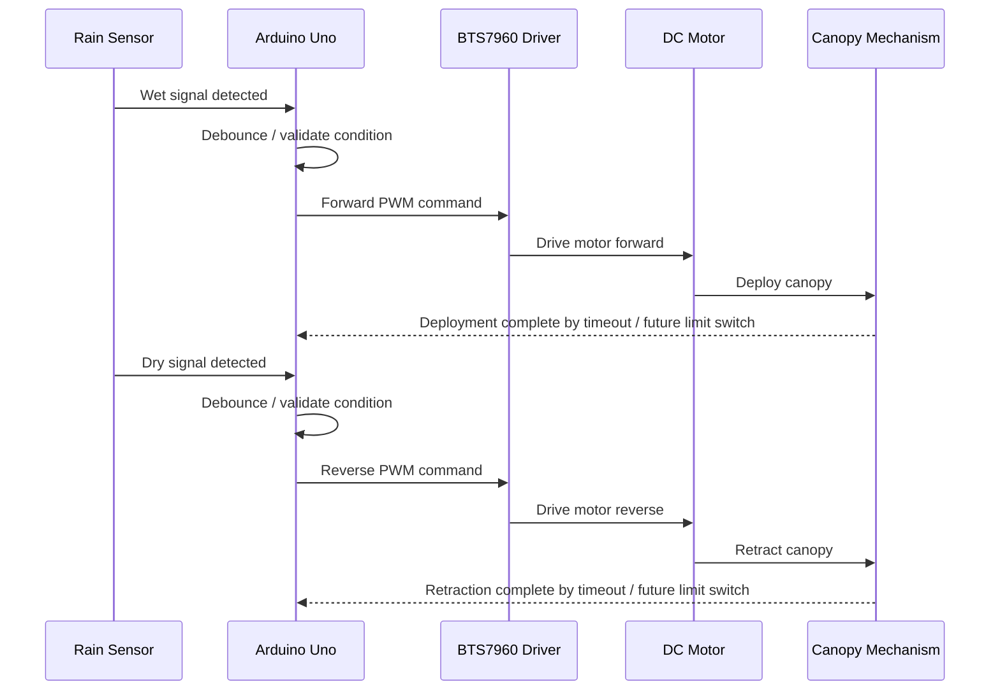
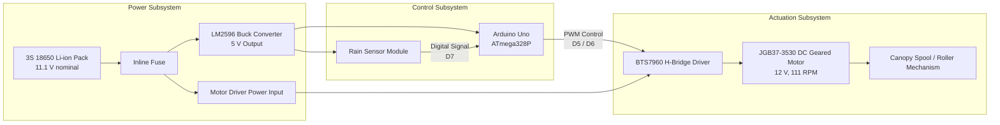
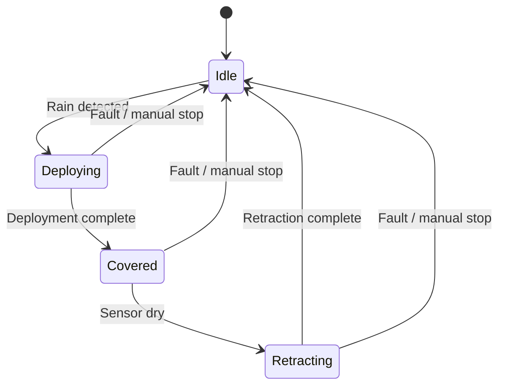
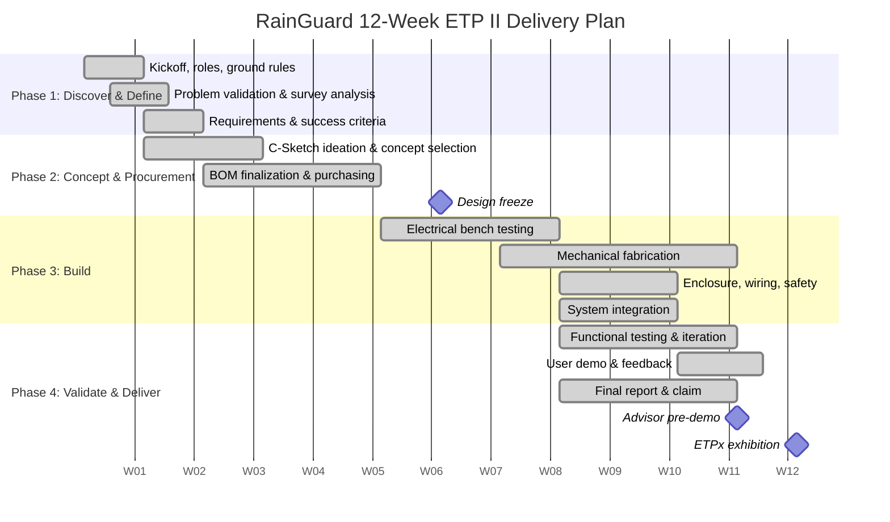
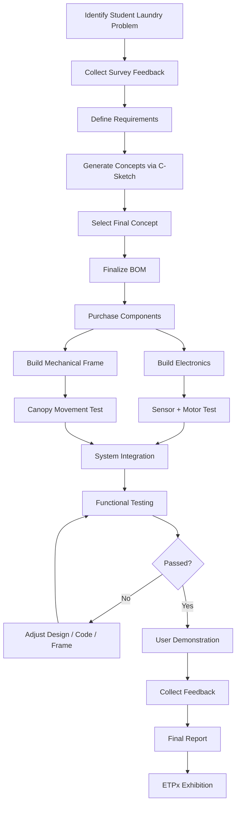

# RainGuard 🌧️

<p align="center">
  
  
  
  
  
  
  
</p>

<p align="center">
  <strong>RainGuard: Smart Retractable Roof System</strong><br />
  <em>Autonomous rain-protection canopy for semi-outdoor laundry drying racks</em><br />
  <em>Engineering Team Project II (MFB2102) • Universiti Teknologi PETRONAS</em>
</p>

<p align="center">
  <a href="#overview">Overview</a> •
  <a href="#problem-and-user-need">Problem</a> •
  <a href="#key-features">Features</a> •
  <a href="#how-it-works">How It Works</a> •
  <a href="#system-architecture">Architecture</a> •
  <a href="#project-milestones">Milestones</a> •
  <a href="#testing-and-validation">Testing</a> •
  <a href="#budget-and-commercialization">Budget</a> •
  <a href="#quick-start">Quick Start</a> •
  <a href="#team-and-credits">Team</a>
</p>

---

## Overview

**RainGuard** is an automated, non-permanent motorized roof system designed for student hostels, balconies, and semi-outdoor laundry areas.

When rain is detected, the system automatically deploys a lightweight waterproof canopy to protect drying clothes. When the rain stops and the sensor dries, the canopy retracts to allow natural airflow and sunlight drying to continue.

The system was developed to solve a common problem among UTP hostel students: sudden rain rewetting clothes, causing repeated washing, wasted time, and unnecessary inconvenience.

> **Design focus:** affordable, automated, clamp-mounted, portable, and safe for hostel use.

### Key Success Criteria

| Criterion | Requirement |
|---|---|
| Automated detection | Detect water presence in real time using a rain sensor |
| Responsiveness | Deploy immediately during rain and retract after drying |
| Non-permanent installation | Clamp-based mounting without drilling or permanent modification |
| Reliability and durability | Lightweight but weather-resistant structure |
| User satisfaction | Reduce repeated washing and improve student convenience |

---

## Problem and User Need

Many students dry clothes in semi-outdoor corridors or balconies. These areas provide good airflow and sunlight but offer limited protection from sudden rainfall.

At Universiti Teknologi PETRONAS (UTP), not all residential village drying rack areas are covered. As a result, clothes left outside to dry can easily become wet again during sudden rain.

### Field Findings

| Finding | Result | Interpretation |
|---|---:|---|
| Respondents experienced clothes getting wet again due to rain | **77%** | Strong real-world need |
| Respondents interested in an automatic retractable roof | **79%** | Clear user acceptance |

### Target User Persona

A typical user is a busy hostel student who balances classes, labs, meetings, and assignments. The user needs a simple and practical system that protects laundry automatically without requiring constant weather monitoring or permanent installation.

RainGuard addresses this by providing a flexible, clamp-mounted automated roof that can be installed on existing drying racks.

---

## Key Features

- **Automatic rain detection** using a raindrop sensor module.
- **Motorized deploy/retract mechanism** using a high-torque DC geared motor.
- **Non-permanent clamp-based installation** suitable for hostel drying racks.
- **Adjustable roof coverage** to support different rack sizes.
- **Lightweight waterproof canopy** using parachute-style material.
- **Rechargeable battery-powered operation**.
- **Weather-protected electronics enclosure**.
- **Low-cost prototype** compared with permanent awnings or electric dryers.

---

## Gallery

<table align="center" width="100%" style="border-collapse: collapse; border: none;">
  <tr>
    <td width="50%" align="center" valign="middle" style="padding: 4px; border: none;">
      <div align="center"><b>Deployed System on Drying Rack</b></div>
      <a href="images/rack_deployment.png" target="_blank" style="display: block; margin-top: 4px;">
        
      </a>
    </td>
    <td width="50%" align="center" valign="middle" style="padding: 4px; border: none;">
      <div align="center"><b>Weather-Sealed Electronics Box</b></div>
      <a href="images/control_enclosure.png" target="_blank" style="display: block; margin-top: 4px;">
        
      </a>
    </td>
  </tr>
  <tr>
    <td width="50%" align="center" valign="middle" style="padding: 4px; border: none;">
      <div align="center"><b>Mechanical Frame CAD Concept</b></div>
      <a href="images/cad_model.png" target="_blank" style="display: block; margin-top: 4px;">
        
      </a>
    </td>
    <td width="50%" align="center" valign="middle" style="padding: 4px; border: none;">
      <div align="center"><b>Benchtop Verification Testing</b></div>
      <a href="images/bench_test.png" target="_blank" style="display: block; margin-top: 4px;">
        
      </a>
    </td>
  </tr>
</table>

---

## How It Works

RainGuard continuously monitors the rain sensor. When water droplets are detected, the Arduino activates the motor in the deployment direction. Once the sensor dries, the motor reverses and retracts the canopy.

### Operational Flowchart



### Simple Behavior Summary

| Condition | Sensor State | System Action |
|---|---|---|
| Clear weather | Dry | Roof remains retracted |
| Rain starts | Wet | Roof deploys |
| Rain continues | Wet | Roof remains deployed |
| Rain stops | Dry | Roof retracts |

### Event Sequence



---

## System Architecture

RainGuard uses a separated power and logic architecture to reduce electrical noise from the motor and improve reliability.

### Power and Signal Topology



---

## Hardware and Pinout

### Core Components

| Component | Specification | Function |
|---|---|---|
| Arduino Uno | ATmega328P, 5 V logic | Main controller |
| Rain Sensor Module | SN-RAIN-MOD / YL-83 class | Detects water droplets |
| DC Geared Motor | JGB37-3530, 12 V, 111 RPM | Drives canopy deployment |
| Motor Driver | BTS7960 high-current H-bridge | Controls motor direction |
| Buck Converter | LM2596 step-down module | Provides 5 V logic rail |
| Battery Pack | 3S 18650 Li-ion | Portable power source |
| Canopy Material | Waterproof parachute fabric | Rain protection layer |
| Mounting | Clamp-based bracket | Non-permanent rack attachment |

### System Pin Interconnect

| Pin / Terminal | Connected To | Description |
|---|---|---|
| `D5` | Motor driver `RPWM` | Forward / deploy PWM control |
| `D6` | Motor driver `LPWM` | Reverse / retract PWM control |
| `D7` | Rain sensor digital output | Wet condition input |
| `5V` | Arduino, sensor, driver logic | Regulated logic supply |
| `GND` | Common ground | Shared reference |
| `B+ / B-` | Battery pack | High-current motor supply |
| `M+ / M-` | DC motor terminals | Motor drive output |
| `R_EN / L_EN` | Driver enable pins | Tied high for continuous enable |

> **Note:** If the rain sensor module provides only an analog output, an analog input such as `A0` can be used with a software threshold instead.

---

## Firmware and Control Logic

The firmware is implemented on the Arduino Uno in C++. Its main responsibilities are:

1. Read the rain sensor.
2. Debounce the sensor to reduce false triggering.
3. Control motor direction using PWM outputs.
4. Apply a soft-start ramp to reduce current spike and mechanical shock.
5. Manage deploy/retract states.

### Control State Machine



### Soft-Start Motor Ramp

A soft-start PWM ramp is used to reduce inrush current, gear shock, and voltage disturbance during motor startup.

Example ramp calculation:

```text
PWM step size       = 5
PWM target          = 200
Delay per step      = 30 ms

Ramp duration = ((200 - 0) / 5 + 1) × 30 ms
              = 41 × 30 ms
              = 1,230 ms
              ≈ 1.23 s
```

With a calibrated full-speed travel time of approximately `7.00 s`:

```text
Total actuation time = 1.23 s + 7.00 s
                     = 8.23 s
```

### Example Retraction Routine

```cpp
const uint8_t RPWM = 5;
const uint8_t LPWM = 6;

void retractCover() {
  analogWrite(RPWM, 0);

  for (int speed = 0; speed <= 200; speed += 5) {
    analogWrite(LPWM, speed);
    delay(30);
  }
}
```

> For production use, limit switches, current sensing, or timeout-based stall protection should be added for safer end-of-travel detection.

---

## Mechanical Design

RainGuard is designed for hostel environments where permanent modification is not allowed.

### Mechanical Highlights

| Feature | Description |
|---|---|
| Clamp mounting | Attaches to existing drying rack without drilling |
| Adjustable frame | Accommodates different rack widths and lengths |
| Lightweight canopy | Reduces motor load |
| Waterproof fabric | Protects laundry during rain |
| Roller/spool mechanism | Allows controlled deployment and retraction |
| Portable design | Can be moved between racks if needed |

### Mechanical Operating Concept


---

## Project Milestones

The project was executed over a 12-week Engineering Team Project II cycle. The milestone structure below combines planning, procurement, build, integration, validation, and delivery phases.

### Delivery Phase Gates


---

### 12-Week Milestone Schedule

The following Gantt chart shows the representative 12-week delivery plan used for the RainGuard prototype.



---

### Milestone Gate Reviews

| Gate | Milestone | Target Week | Objective | Exit Criteria | Evidence | Status |
|---|---|---:|---|---|---|---|
| `M0` | Project Kickoff & Team Setup | W1 | Establish team roles, ground rules, and project direction | Team formed, leader assigned, problem statement understood | Meeting notes | ✅ Completed |
| `M1` | Problem Validation | W1–W2 | Confirm real user need among hostel students | Survey findings reviewed, 77% affected users identified | Survey summary | ✅ Completed |
| `M2` | Requirements Definition | W2 | Define technical and user-centered success criteria | Sensor, motor, installation, and reliability requirements documented | Project report | ✅ Completed |
| `M3` | Concept Development | W2–W4 | Explore multiple design concepts using C-Sketch | Top concepts shortlisted and final concept selected | C-Sketch output | ✅ Completed |
| `M4` | Design Freeze | W4 | Lock final mechanical and electronic concept | Roof mechanism, sensor placement, and motor approach approved | Design record | ✅ Completed |
| `M5` | Procurement Completion | W2–W4 | Purchase all required components | Components received and inspected | Purchase list | ✅ Completed |
| `M6` | Electronics Verification | W5–W6 | Validate sensor, controller, and motor driver behavior | Sensor triggers motor correctly in both directions | Bench test | ✅ Completed |
| `M7` | Mechanical Build Completion | W7–W9 | Fabricate frame, canopy, rollers, and clamp system | Mechanical assembly moves smoothly and fits rack | Garage 21 build | ✅ Completed |
| `M8` | System Integration | W9–W10 | Combine electronics and mechanical subsystems | Complete unit operates as one automated system | Integrated prototype | ✅ Completed |
| `M9` | Functional Testing & Iteration | W10–W11 | Validate rain response, deployment, and retraction | Wet/dry cycle test passed | Test results | ✅ Completed |
| `M10` | User Validation | W11 | Collect feedback from hostel students | Users find system useful and practical | User feedback | ✅ Completed |
| `M11` | Final Documentation | W8–W11 | Prepare final report, budget, claim, and presentation materials | Final report completed | Final report | ✅ Completed |
| `M12` | Advisor Pre-Demo | W11 | Present working prototype before exhibition | Advisor feedback received and addressed | Advisor demo | ✅ Completed |
| `M13` | ETPx Exhibition | W12 | Demonstrate final prototype publicly | Functional demonstration completed | ETPx showcase | ✅ Completed |

---

### Detailed Weekly Activity Map

The project activities were organized across the following weekly structure.

| Week | Main Activities | Deliverables |
|---:|---|---|
| W1 | Team meeting, role assignment, initial requirements discussion | Project scope, team roles |
| W2 | Problem validation, survey analysis, initial concept discussion | User need summary |
| W3 | C-Sketch ideation, concept comparison, BOM planning | Shortlisted concepts |
| W4 | Final concept selection, design freeze, purchasing preparation | Approved concept |
| W5 | Component purchasing, electronics testing preparation | Component list, procurement progress |
| W6 | Sensor and microcontroller testing, motor driver validation | Electronics bench test |
| W7 | Mechanical frame planning, material selection | Mechanical layout |
| W8 | Mechanical fabrication in Garage 21 | Frame assembly progress |
| W9 | Canopy installation, roller mechanism tuning | Mechanical prototype |
| W10 | System integration, wiring organization, enclosure setup | Integrated prototype |
| W11 | Functional testing, user demonstration, report writing | Test results, feedback |
| W12 | Final presentation preparation and ETPx demonstration | Final showcase |

---

### Original Activity Legend Mapping

The final report used the following activity legend for scheduling.

| Activity ID | Activity | Project Phase | Milestone Impact |
|---:|---|---|---|
| 1 | Conduct meeting among members to discuss items needed for purchase | Planning | Procurement readiness |
| 2 | Purchase required items | Procurement | Component availability |
| 3 | Do minor tweaks and adjustments to the product | Iteration | Improved reliability |
| 4 | Finalize product design | Design freeze | Build authorization |
| 5 | Start working on electronics part | Build | Circuit and sensor validation |
| 6 | Fill up claim form | Administration | Budget compliance |
| 7 | Build mechanical part in Garage 21 | Build | Mechanical prototype |
| 8 | Write final report | Documentation | Final deliverable |
| 9 | Present finished product to advisor before ETPx | Validation | Advisor approval |
| 10 | Present product during ETPx | Delivery | Public demonstration |

---

### Development Workflow



---

### Design Iteration Log

During development, the team made several important design changes.

| Iteration | Issue | Improvement | Outcome |
|---|---|---|---|
| 1 | Initial concept had limited coverage area | Expanded canopy coverage | More practical for real drying racks |
| 2 | Original design not suitable for multiple rack types | Introduced adjustable width/length concept | Better compatibility across hostel racks |
| 3 | Motor selection needed revision due to updated mechanical load | Evaluated higher-torque DC geared motor | Reliable deployment and retraction |
| 4 | Roof structure needed to be lightweight but stable | Used lightweight frame with parachute fabric | Reduced motor load while maintaining coverage |
| 5 | Wiring exposed to moisture risk | Used weather-resistant enclosure and cable management | Improved safety and durability |

---

## Testing and Validation

Testing was conducted to validate sensor response, motor actuation, mechanical movement, and user usefulness.

### Functional Test Matrix

| Test | Method | Expected Result | Outcome |
|---|---|---|---|
| Rain detection | Apply water to rain sensor | Sensor detects wet condition | Passed |
| Deployment response | Trigger motor after wet detection | Canopy deploys | Passed |
| Retraction response | Dry sensor after rain simulation | Canopy retracts | Passed |
| Motor torque | Observe canopy movement under load | Motor moves roof smoothly | Passed after tuning |
| Power stability | Monitor MCU behavior during motor start | No reset or brownout observed | Improved with soft-start |
| Mechanical fit | Mount system onto drying rack | Clamp-based installation successful | Passed |
| User feedback | Demonstrate to hostel students | System perceived as useful | Positive |

### Key Validation Results

| Metric | Result |
|---|---|
| Rain detection | Successfully triggered deployment |
| Retraction after drying | Successfully returned to original state |
| Deployment/retraction time | Approximately **8.23 seconds** |
| Installation method | Non-permanent clamp mount |
| User interest | **79%** positive interest |
| Problem occurrence | **77%** experienced clothes getting rewetted |

### User Feedback Summary

Students found the system useful because it:

- Reduces the need to constantly monitor weather.
- Helps avoid repeated washing due to rain-soaked clothes.
- Can be installed without permanent modification.
- Is suitable for hostel environments with limited drying space.

---

## Budget and Commercialization

The prototype was developed within the ETP budget. The total component cost remained low enough to support personal or hostel-level use.

### Prototype Cost Summary

| Category | Function | Cost |
|---|---|---:|
| Controller | Arduino Uno-based control platform | Dev board |
| Motor and driver | Canopy actuation and directional control | RM 59.32 |
| Sensor | Rain detection | RM 6.50 |
| Power system | Batteries, charger, holder, converter | RM 23.68 |
| Mechanical materials | Canopy, rollers, rope, PVC, frame parts | RM 31.70 |
| Protection and housing | Enclosure, wiring protection, safety components | RM 39.89 |
| **Total Prototype Cost** |  | **RM 161.09** |

<details>
<summary><strong>Full Itemized Expenses</strong></summary>

| Item | Price (MYR) |
|---|---:|
| AA Battery Holder | 1.79 |
| MG995-180 Deg Metal Servo Motor | 16.90 |
| Water Raindrops Weather Rain Sensor Module | 6.50 |
| AA4 Carbon Battery | 5.90 |
| 4 mm Starter Rope | 2.40 |
| PVC | 6.00 |
| Cable Ties | 3.50 |
| Metal Roller | 3.00 |
| Rope | 1.00 |
| Raincoat | 3.30 |
| Window Washer | 15.00 |
| Rechargeable 18650 Lithium Battery 20000 mAh Flat Top | 8.37 |
| Rechargeable 18650 Lithium Battery 2 Slot Charger | 7.81 |
| Lithium 18650 Battery Holder | 4.50 |
| DC JGB37-12V-111RPM Motor | 39.90 |
| DC Motor Driver Smart Current Sensor Drive | 19.42 |
| DC-DC Adjustable Converter Module | 3.00 |
| Value Pack Alkaline Battery | 12.80 |
| **Total** | **161.09** |

</details>

### Budget Allocation

| Item | Amount |
|---|---:|
| ETP Budget | RM 500.00 |
| Total Expenses | RM 161.09 |
| Emergency Fund | RM 50.00 |
| Remaining Funds | RM 288.91 |

### Commercial Pricing Estimate

Using a prototype-based profit margin of **35%**:

```text
Cost          = RM 161.09
Profit margin = 35%

Profit = 35% × RM 161.09
       = RM 56.38

Selling price = Cost + Profit
              = RM 161.09 + RM 56.38
              = RM 217.47
              ≈ RM 217.50
```

| Item | Value |
|---|---:|
| Production cost | RM 161.09 |
| Profit | RM 56.38 |
| Estimated selling price | **RM 217.50** |

This price is significantly lower than permanent awning systems and avoids the high electricity usage of electric clothes dryers.

---

## Quick Start

This section provides a high-level guide to reproduce or demonstrate the RainGuard prototype.

### 1. Prepare the Hardware

Ensure the following components are available:

- Arduino Uno or compatible microcontroller
- Rain sensor module
- BTS7960 or equivalent high-current motor driver
- 12 V DC geared motor
- 3S Li-ion battery pack
- LM2596 buck converter
- Canopy frame and roller mechanism
- Weather-resistant enclosure
- Jumper wires, connectors, fuse, and switch

### 2. Wire the System

Basic wiring order:

1. Connect the battery pack to the motor driver power terminals.
2. Connect the motor terminals to the motor driver outputs.
3. Connect the buck converter input to the battery rail.
4. Set buck converter output to approximately **5 V**.
5. Power the Arduino and sensor from the 5 V rail.
6. Connect rain sensor digital output to Arduino pin `D7`.
7. Connect motor driver PWM inputs to Arduino pins `D5` and `D6`.
8. Connect all grounds together.

> **Safety note:** Always use an inline fuse on the battery side and verify polarity before powering the system.

### 3. Upload Firmware

Upload the Arduino firmware implementing:

- Rain sensor reading
- Debounce logic
- Deploy/retract state control
- PWM soft-start motor control

### 4. Calibrate the Sensor

- Test with a small amount of water.
- Ensure the sensor does not false-trigger from humidity alone.
- Add debounce delay if needed.

### 5. Test the Mechanism

Manually verify before full automation:

- Canopy moves freely.
- No cable jamming.
- Motor has enough torque.
- Roof does not overtravel.

### 6. Mount to Drying Rack

- Attach clamp mounts securely.
- Position rain sensor in an exposed location.
- Keep electronics inside the weatherproof enclosure.
- Route cables neatly to avoid snagging.

---

## ESG Impact

RainGuard was also evaluated for environmental, social, and governance impact.

| Area | Impact |
|---|---|
| Environmental | Reduces repeated washing, saving water and electricity. Encourages natural drying instead of electric dryers. |
| Social | Saves time for students with tight academic schedules. Reduces inconvenience from unpredictable weather. |
| Governance | Promotes safe wiring practices, protected electronics, and non-permanent installation suitable for hostel regulations. |

---

## Future Improvements

The current prototype demonstrates core functionality. Future development can focus on the following improvements:

| Improvement | Description |
|---|---|
| Solar power | Use solar charging to reduce battery dependency |
| Mobile monitoring | Add Bluetooth or Wi-Fi status notifications |
| Weather forecast integration | Use forecast data to prepare the canopy before rain |
| Limit switches | Improve end-position detection and safety |
| Current sensing | Detect motor stall or obstruction |
| Mass-production design | Reduce cost through optimized manufacturing |
| Stronger weather resistance | Improve sealing, corrosion resistance, and UV durability |

---

## Challenges and Lessons Learned

### Technical Challenges

- Initial design needed modification to support wider rack compatibility.
- The adjustable canopy introduced more complex mechanical requirements.
- Motor selection needed re-evaluation after design changes.
- Material availability required practical substitutions and adjustments.

### Teamwork Lessons

- Frequent communication helped the team respond quickly to design changes.
- Clear role assignment improved execution efficiency.
- Open discussion helped resolve technical issues faster.
- Accountability and early problem detection reduced last-minute risk.

### Team Ground Rules

1. Always keep in touch with each other, whether it is ideas, challenges, or updates. Keep an open mind to new ideas.
2. Take accountability for assigned tasks. Always meet deadlines and give full commitment.
3. Always find problems before they appear. There is always room for improvement.

---

## Team and Credits

**Team Name:** The Inventor  
**Group Number:** 18  
**Course:** MFB2102 Engineering Team Project II  
**Institution:** Universiti Teknologi PETRONAS  
**Team Leader:** Muhammad Rieqhmal Mukhreez Bin Rozmi  
**Coach:** AP Dr Norhayati binti Mellon

| No. | Name | ID | Department | Role |
|---:|---|---|---|---|
| 1 | Muhammad Rieqhmal Mukhreez Bin Rozmi | 24003469 | COE | Team leader, roof behavior programming using Arduino |
| 2 | Idriss Rama Salim | 24001751 | EE | Electrical and electronics circuit building |
| 3 | Zaim Bazli Bin Mohd Arifin | 22010438 | ME | Lead mechanical design and build |
| 4 | Devaline Zheyrra Jeanesya | 25005916 | CHE | Roof material, environmental impact assessment, treasurer |
| 5 | Nur Faten Syakirah Binti Ahmad Farid | 22010059 | PE | Roof placement strategy and structural integrity |
| 6 | Aisar Bin Abdul Rahman | 22010582 | CHE | Mechanical part design and build |

---

## References

1. Tan, X., Yang, L., He, Y., & Chen, J. (2023). Research on IoT-based smart clothes drying rack. In *2023 5th International Conference on Internet of Things, Automation and Artificial Intelligence (IoTAAI 2023)* (pp. 275–281). ACM. https://doi.org/10.1145/3653081.3653127

2. Weather & Climate. (n.d.). Seri Iskandar (MY) average monthly precipitation. Retrieved November 22, 2025, from https://weather-and-climate.com/average-monthly-precipitationRainfall,seri-iskandar-my,Malaysia

3. webotricks. (2025, March 27). Rain Detection System Using Arduino. Arduino Project Hub. Retrieved November 22, 2025, from https://projecthub.arduino.cc/webotricks/rain-detection-system-using-arduino-jec