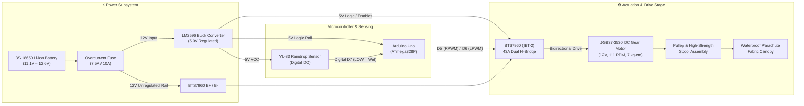
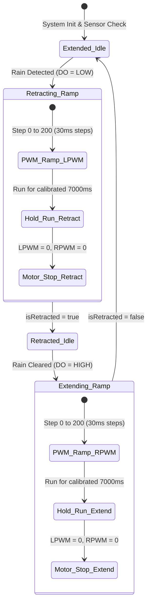

<div align="center">

# RainGuard: Smart Retractable Drying Rack System

**An autonomous, mechatronic weather-defense system that detects rainfall in real time and automatically deploys a high-torque motorized protective canopy to safeguard clothes.**

<p align="center">
  
  
  
  
  
  
</p>

[Project Overview](#overview) • [System Architecture](#system-architecture) • [Key Engineering Highlights](#key-engineering-highlights) • [Hardware & BOM](#hardware-specifications--bom) • [Firmware Logic](#firmware--control-algorithm) • [Engineering Challenges](#engineering-challenges--mitigations) • [Gallery](#prototype-gallery)

---

</div>

## Overview

In semi-outdoor living environments (such as university dormitories and residential apartments), sudden tropical precipitation frequently drenches clothes hung out to dry, causing laundry wastage, unpleasant odors, and repeated re-washing cycles.

**RainGuard** is a non-permanent, clamp-mounted mechatronic canopy system. Using conductive raindrop sensing, an isolated dual-rail power topology, and a bidirectional high-current H-bridge driver, the system automatically detects water droplets within milliseconds and actuates a waterproof canopy over the drying rack. When clear weather returns, it autonomously retracts the canopy to resume natural sun drying.

### Primary Design Objectives
- **Zero-Latency Rain Detection**: Immediate interruptible detection of rain droplets via digital hysteresis sensing.
- **High-Torque Smooth Actuation**: Controlled bidirectional spool drive with soft-start PWM to prevent inrush current spikes and mechanical gear shock.
- **Non-Invasive Universal Mounting**: Clamp-based modular framing that mounts onto standard laundry racks without structural drilling or modifications.
- **Off-Grid Autonomous Power**: Integrated 3S lithium-ion power source with stepped-down logic regulation and multi-point ground decoupling.

---

## Prototype Gallery

| Deployed on Drying Rack | Weather-Resistant Control Enclosure |
|:---:|:---:|
|  |  |
| **System Overview & Mechanism** | **Benchtop Verification & Sensor Testing** |
|  |  |

---

## Key Engineering Highlights

```
┌─────────────────────────────────────────────────────────────────────────────┐
│                            CORE SYSTEM FEATURES                             │
├──────────────────────┬──────────────────────┬───────────────────────────────┤
│ ⚡ PWM Soft-Start    │ 🛡️ Dual-Rail Power   │ 🔄 State-Latched Motion       │
│ 41-step linear ramp  │ 12V motor supply +   │ Deterministic finite-state    │
│ eliminates startup   │ LM2596-regulated 5V  │ logic prevents cyclic jitter  │
│ inrush current surge │ logic decoupling     │ and false re-triggering       │
└──────────────────────┴──────────────────────┴───────────────────────────────┘
```

1. **Inrush Current & Shock Suppression (Soft-Start PWM)**: DC motors experience high stall/inrush currents ($I_{stall} \approx 4.3\,\text{A}$) at sudden full-voltage turn-on. The firmware implements a 41-step linear PWM ramp ($0 \to 200$ over $\approx 1.23\,\text{s}$ in $30\,\text{ms}$ increments), mitigating mechanical gear stress, spool jerking, and battery voltage sag.
2. **Dual-Rail Power Topology**: High-current motor inductive loads are isolated from sensitive MCU logic rails. A 3S Li-ion pack ($11.1\,\text{V}$ nominal / $12.6\,\text{V}$ peak) feeds the BTS7960 power stage directly, while an LM2596 switching buck converter steps down to a steady $5.0\,\text{V}$ rail for the ATmega328P and sensor circuitry.
3. **State-Latched Deterministic Logic**: Software maintains state-tracking variables (`isRetracted`) to prevent repeated actuation cycles when intermittent raindrops land on the sensor.

---

## System Architecture

### Hardware & Power Distribution Topology



---

## Firmware & Control Algorithm

### State Machine Flow

The controller operates as a deterministic finite state machine (FSM) evaluated on every cycle of `loop()`:



### Soft-Start Timing & Math

$$\text{Ramp Steps} = \frac{200 - 0}{5} + 1 = 41\,\text{steps}$$

$$T_{\text{soft-start}} = 41 \times 30\,\text{ms} = 1{,}230\,\text{ms}\ (1.23\,\text{s})$$

$$T_{\text{total\_actuation}} = T_{\text{soft-start}} + T_{\text{runTime}} = 1.23\,\text{s} + 7.00\,\text{s} = 8.23\,\text{s}$$

```cpp
// Core Soft-Start Profile Implementation
void retractCover() {
  analogWrite(RPWM, 0);
  for (int speed = 0; speed <= 200; speed += 5) {
    analogWrite(LPWM, speed);
    delay(30); // 1.23s smooth acceleration ramp
  }
}

void extendCover() {
  analogWrite(LPWM, 0);
  for (int speed = 0; speed <= 200; speed += 5) {
    analogWrite(RPWM, speed);
    delay(30);
  }
}
```

---

## Hardware Specifications & BOM

### Bill of Materials (BOM)

| # | Component | Technical Specification | Function in System | Cost (MYR) |
|:---:|---|---|---|:---:|
| 1 | **Arduino Uno R3** | ATmega328P, 16 MHz, 32 KB Flash, 5V Logic | Master controller executing FSM & PWM routines | Standard Dev |
| 2 | **JGB37-3530 DC Motor** | 12V DC, 111 RPM, 7 kg·cm rated / 24 kg·cm stall | High-torque canopy spool drive | RM 39.90 |
| 3 | **BTS7960 (IBT-2)** | 43A peak, Dual H-Bridge with thermal/overcurrent protection | Bidirectional high-current motor driver | RM 19.42 |
| 4 | **YL-83 Rain Sensor** | Nickel-plated board, LM393 comparator with potentiometer | Real-time water detection via digital output | RM 6.50 |
| 5 | **LM2596 DC-DC Converter** | Buck converter, 3A max, set to 5.0V output ($\pm 0.05\text{V}$) | Stepped-down regulated logic rail | RM 3.00 |
| 6 | **3S 18650 Battery Pack** | 11.1V nominal (12.6V peak), high-discharge cells | Autonomous portable DC power source | RM 20.68 |
| 7 | **Canopy Fabric** | Hydrophobic high-density parachute material | Lightweight, waterproof rack shelter | RM 3.30 |
| 8 | **Mechanical Hardware** | 4mm starter rope, metal rollers, PVC frame sliders | Linear transmission and frame guiding | RM 27.40 |
| 9 | **Protection & Cabling** | Fuse holder, inline switch, terminal blocks, enclosure | Electrical safety and enclosure routing | RM 40.89 |
| **Total** | | | **Prototype Production Cost** | **RM 161.09** |

*Note: In production with commercial 35% margin, target unit price is **RM 217.50** (~$48 USD).*

---

## Electrical Pinout & Wiring

<div align="center">
  
  <p><em>Figure: Schematic wiring interconnect between Arduino Uno, BTS7960, LM2596, and YL-83 sensor.</em></p>
</div>

### Interconnect Matrix

| Subsystem | Module Pin | Connected To | Signal / Operating Level |
|---|---|---|---|
| **Motor Driver Logic** | `RPWM` | Arduino `D5` | PWM Forward / Extend Signal ($0\text{–}5\,\text{V}$) |
| | `LPWM` | Arduino `D6` | PWM Reverse / Retract Signal ($0\text{–}5\,\text{V}$) |
| | `R_EN`, `L_EN` | LM2596 `5V` Rail | Driver Bridge Enable ($5\,\text{V}$ Logic High) |
| | `VCC` / `GND` | LM2596 `5V` / Common GND | Logic Supply |
| **Motor Power Stage** | `B+` / `B-` | 3S Battery Positive / Negative | High-Current Rail ($11.1\text{–}12.6\,\text{V}$) |
| | `M+` / `M-` | JGB37-3530 Terminals | Motor Armature Drive |
| **Rain Sensor** | `VCC` / `GND` | LM2596 `5V` / Common GND | Sensor Bias Supply |
| | `DO` | Arduino `D7` | Digital Threshold Output (`LOW` = Rain, `HIGH` = Dry) |
| **MCU Power** | `5V` / `GND` | LM2596 `5V` / Common GND | Regulated Logic Bus |

---

## Engineering Challenges & Mitigations

### 1. Inductive Noise & Microcontroller Resets
* **Challenge**: Rapid switching of the 12V DC motor generated inductive spikes and transient voltage drops across the battery, causing ATmega328P brownout resets during startup.
* **Mitigation**:
  - Implemented an isolated dual-rail architecture where the LM2596 buck converter acts as a regulated buffer for logic circuitry.
  - Software PWM ramp limits instantaneous $di/dt$, eliminating current spikes.
  - Filter capacitor ($1000\,\mu\text{F}$ 25V electrolytic) placed directly across BTS7960 `B+`/`B-` terminals to absorb inductive switching noise.

### 2. Sensor Oscillation & Intermittent Droplets
* **Challenge**: Scattered individual raindrops caused fluctuating digital comparator states, risking rapid motor direction reversals.
* **Mitigation**:
  - State latching in firmware guarantees that once a retraction or extension begins, the sequence completes its calibrated cycle before accepting a new state change.

### 3. Mechanical Drag vs. Motor Torque Sizing
* **Challenge**: Wet fabric and sliding friction on the rack frame increased transmission load under outdoor conditions.
* **Mitigation**:
  - Selected the JGB37-3530 all-metal gearbox DC motor delivering $7\,\text{kg}\cdot\text{cm}$ rated torque (up to $24\,\text{kg}\cdot\text{cm}$ stall torque) paired with lightweight hydrophobic parachute fabric, ensuring reliable pull force with low power consumption.

---

## Quickstart & Upload Guide

### Prerequisites
- [Arduino IDE 2.x+](https://www.arduino.cc/en/software)
- AVR Boards package installed (default in Arduino IDE)

### Flashing Firmware
1. Clone repository:
   ```bash
   git clone https://github.com/idrucheez/Smart-RainGuard-Drying-Rack-System.git
   ```
2. Open [`code/SmartRainCover/SmartRainCover.ino`](code/SmartRainCover/SmartRainCover.ino) in Arduino IDE.
3. Select board **Arduino Uno** and your active serial port.
4. Verify & Upload sketch.
5. Open **Serial Monitor** at `9600 baud` to monitor real-time state transitions.

---

## Project Structure

```
Smart-RainGuard-Drying-Rack-System/
├── README.md                          # Comprehensive technical documentation
├── LICENSE                            # MIT License
├── code/
│   └── SmartRainCover/
│       └── SmartRainCover.ino         # Production Arduino firmware (C++)
├── docs/
│   ├── BILL_OF_MATERIALS.md          # Itemized parts & hardware cost breakdown
│   ├── CONNECTIONS.md                 # Detailed pinout & wiring interconnect guide
│   ├── TEST_CHECKLIST.md              # Bench & field validation checklist
│   ├── FUTURE_IMPROVEMENTS.md         # Hardware & firmware roadmap
│   └── Goup 18 ETP II Project Final Report.pdf  # Comprehensive academic capstone report
└── images/                            # Schematics, CAD models & prototype captures
    ├── rack_deployment.png
    ├── control_enclosure.png
    ├── bench_test.png
    ├── cad_model.png
    └── circuit_schematic.png
```

---

## Engineering Roadmap

- [x] Autonomous rain detection and bidirectional motor actuation
- [x] PWM soft-start acceleration profiling
- [x] Enclosed weather-resistant housing & non-permanent rack clamp design
- [ ] End-stop limit switches (NC micro-switches) for closed-loop physical limit protection
- [ ] Low-battery voltage monitoring with automatic retraction fail-safe
- [ ] Solar harvesting integration (6V/12V solar panel + TP5100 MPPT charge controller)
- [ ] ESP32 upgrade for IoT weather telemetry and remote manual override

---

## Team & Capstone Credits

Developed as part of the **Engineering Team Project (ETP II)** at **Universiti Teknologi PETRONAS (UTP)** by **Group 18 — The Inventor**:

- **Muhammad Rieqhmal Mukhreez Bin Rozmi** — Project Leader & Firmware Development (Arduino/C++)
- **Idriss Rama Salim** — Electrical & Electronics Circuit Architecture
- **Zaim Bazli Bin Mohd Arifin** — Mechanical Design & Fabrication
- **Devaline Zheyrra Jeanesya** — Research & Requirements Analysis
- **Nur Faten Syakirah Binti Ahmad Farid** — Quality Assurance & Testing
- **Aisar Bin Abdul Rahman** — Documentation & Resource Management
- **Project Advisor / Coach**: AP Dr. Norhayati binti Mellon

---

## License

This project is licensed under the **[MIT License](LICENSE)**.
