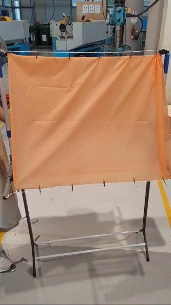
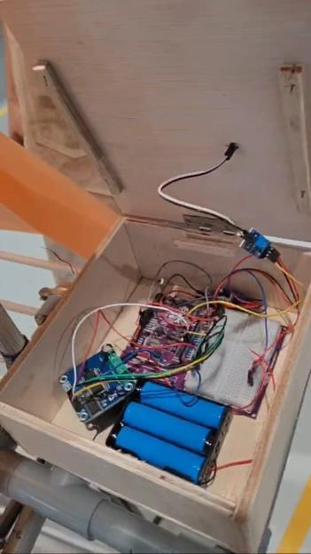
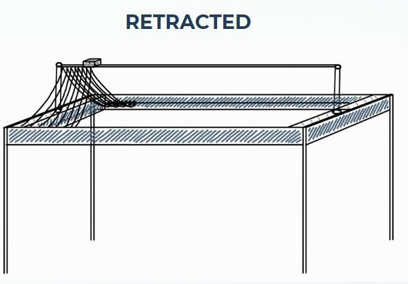
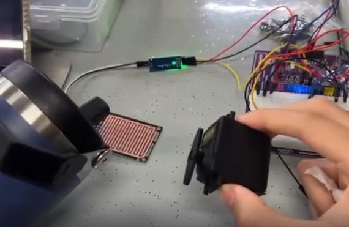
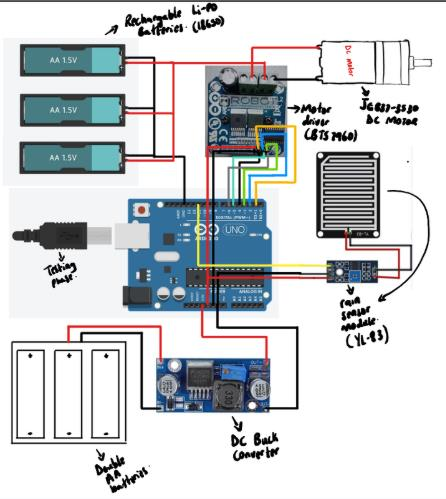

# RainGuard 🌧️

<p align="center">
  
  
  
  
  
  
</p>

<p align="center">
  <strong>Autonomous mechatronic rain-defense canopy for semi-outdoor laundry drying racks.</strong><br>
  <em>Engineering Team Project II (MFB2102) • Universiti Teknologi PETRONAS</em>
</p>

<p align="center">
  <a href="#-project-overview">Overview</a> •
  <a href="#-system-architecture">Architecture</a> •
  <a href="#-hardware--circuit-schematic">Hardware & Pinout</a> •
  <a href="#-firmware--control-profile">Control Logic</a> •
  <a href="#-bill-of-materials">BOM</a> •
  <a href="#-quick-start">Quick Start</a> •
  <a href="#-team--credits">Team</a>
</p>

---

## Overview

**RainGuard** is an automated, non-invasive motorized roof system engineered for student dormitories and residential balconies. When sudden precipitation occurs, a conductive raindrop sensor triggers an Arduino Uno to deploy a waterproof parachute canopy via a high-torque 12V DC geared motor. When clear weather returns, the mechanism reverses to retract the cover and resume natural airflow drying.

> [!NOTE]
> **Non-Permanent Clamp Mounting:** Designed for universal attachment to standard laundry racks without structural drilling, welding, or hostel safety violations.

---

## Gallery

<table align="center" width="100%" style="border-collapse: collapse; border: none;">
  <tr>
    <td width="50%" align="center" valign="middle" style="padding: 4px; border: none;">
      <div align="center"><b>Deployed System on Drying Rack</b></div>
      <a href="images/rack_deployment.png" target="_blank" style="display: block; margin-top: 4px;">
        
      </a>
    </td>
    <td width="50%" align="center" valign="middle" style="padding: 4px; border: none;">
      <div align="center"><b>Weather-Sealed Electronics Box</b></div>
      <a href="images/control_enclosure.png" target="_blank" style="display: block; margin-top: 4px;">
        
      </a>
    </td>
  </tr>
  <tr>
    <td width="50%" align="center" valign="middle" style="padding: 4px; border: none;">
      <div align="center"><b>Mechanical Frame CAD Model</b></div>
      <a href="images/cad_model.png" target="_blank" style="display: block; margin-top: 4px;">
        
      </a>
    </td>
    <td width="50%" align="center" valign="middle" style="padding: 4px; border: none;">
      <div align="center"><b>Benchtop Verification Testing</b></div>
      <a href="images/bench_test.png" target="_blank" style="display: block; margin-top: 4px;">
        
      </a>
    </td>
  </tr>
</table>

---

## 🏗 System Architecture

<details open>
<summary><strong>📊 Interactive Signal & Power Topology</strong></summary>
<br>

```mermaid
graph LR
    subgraph Power ["⚡ Isolated Power Subsystem"]
        BAT["3S 18650 Li-ion<br/>(11.1V–12.6V)"] --> FUSE["Inline Fuse"]
        FUSE -->|"12V Motor Rail"| BTS_PWR["BTS7960 (B+/B-)"]
        FUSE -->|"12V Input"| BUCK["LM2596 Buck (5.0V)"]
    end

    subgraph Control ["🧠 Controller & Sensing"]
        MCU["Arduino Uno<br/>(ATmega328P)"]
        SENSOR["YL-83 Rain Sensor<br/>(LM393 Comparator)"]
        BUCK -->|"5V Logic"| MCU
        BUCK -->|"5V VCC"| SENSOR
        SENSOR -->|"D7 (LOW = Rain)"| MCU
    end

    subgraph Drive ["⚙️ Actuation Mechanism"]
        DRIVER["BTS7960 43A H-Bridge"]
        MOTOR["JGB37-3530 DC Motor<br/>(12V, 111 RPM, 7 kg·cm)"]
        SPOOL["Pulley & Canopy Spool"]

        BUCK -->|"5V Logic / Enables"| DRIVER
        MCU -->|"D5 (RPWM) / D6 (LPWM)"| DRIVER
        BTS_PWR --> DRIVER
        DRIVER -->|"Bidirectional Drive"| MOTOR
        MOTOR --> SPOOL
    end

    classDef pwr fill:#F39C12,stroke:#fff,stroke-width:1px,color:#fff;
    classDef ctrl fill:#00979D,stroke:#fff,stroke-width:1px,color:#fff;
    classDef act fill:#E34F26,stroke:#fff,stroke-width:1px,color:#fff;
    class Power pwr;
    class Control ctrl;
    class Drive act;


## Hardware & Circuit Schematic

<table align="left" width="100%" style="border-collapse: collapse; border: none;">
  <tr>
    <!-- Left Column: Compact Pinout Table -->
    <td width="42%" valign="top" style="padding: 0 10px 0 0; border: none;">
      <details open>
        <summary><b>System Pin Interconnect</b></summary>
        <br>
        <table width="100%" style="font-size: 11px; border-collapse: collapse;">
          <thead>
            <tr>
              <th align="left" style="width: 28%;">Pin</th>
              <th align="left">Interface & Hardware Target</th>
            </tr>
          </thead>
          <tbody>
            <tr><td><code>D5</code></td><td>BTS7960 <code>RPWM</code> (Extend / Forward)</td></tr>
            <tr><td><code>D6</code></td><td>BTS7960 <code>LPWM</code> (Retract / Reverse)</td></tr>
            <tr><td><code>D7</code></td><td>YL-83 Sensor <code>DO</code> (Active LOW = Wet)</td></tr>
            <tr><td><code>5V</code></td><td>LM2596 Output (Powers Uno, Sensor, Driver logic)</td></tr>
            <tr><td><code>GND</code></td><td><strong>Common System Ground Reference</strong></td></tr>
            <tr><td><code>R_EN/L_EN</code></td><td>Tied to 5V (Continuous Driver Enable)</td></tr>
            <tr><td><code>B+/B-</code></td><td>Direct 3S Battery Rail (High Current)</td></tr>
            <tr><td><code>M+/M-</code></td><td>JGB37-3530 DC Motor Terminals</td></tr>
          </tbody>
        </table>
      </details>
    </td>
    <!-- Right Column: Circuit Schematic Card -->
    <td width="58%" valign="top" style="padding: 0 0 0 10px; border: none;">
      <div style="background: #0d1117; border: 1px solid #30363d; border-radius: 8px; padding: 12px; text-align: center;">
        <strong style="color: #58a6ff; font-size: 13px; display: block; margin-bottom: 6px;">Wiring & Power Schematic</strong>
        <a href="images/circuit_schematic.png" target="_blank">
          
        </a>
        <p style="color: #8b949e; font-size: 11px; margin: 6px 0 0 0; line-height: 1.3;">
          Dual-rail topology: 12V battery bus drives high-current inductive motor loads; regulated 5V buck rail powers logic.
        </p>
      </div>
    </td>
  </tr>
</table>

---

## Firmware & Control Profile

### Soft-Start Acceleration Profile
To eliminate inrush current spikes ($I_{\text{stall}} \approx 4.3\text{A}$), mechanical gear shock, and MCU brownouts, the motor is accelerated via a linear 41-step PWM ramp:

$$\text{Ramp Duration} = \left(\frac{200 - 0}{5} + 1\right) \times 30\,\text{ms} = 1{,}230\,\text{ms}\ (1.23\,\text{s})$$

$$\text{Total Actuation Time} = T_{\text{soft-start}} + T_{\text{runTime}} = 1.23\,\text{s} + 7.00\,\text{s} = 8.23\,\text{s}$$

```cpp
// Retract cover with smooth acceleration profile
void retractCover() {
  analogWrite(RPWM, 0);
  for (int speed = 0; speed <= 200; speed += 5) {
    analogWrite(LPWM, speed);
    delay(30); // 1.23s acceleration window
  }
}
